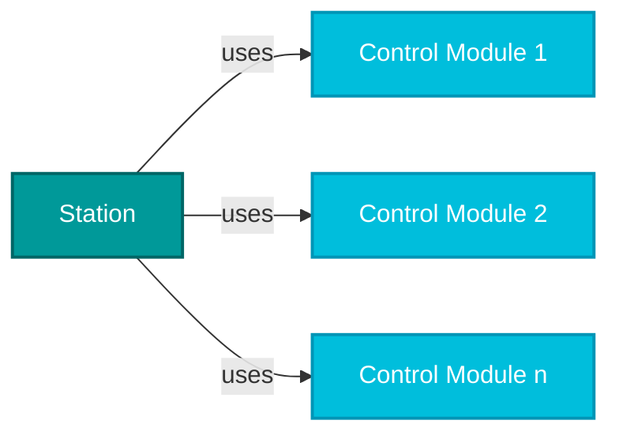

# SIMATIC AX - Packaging Sorting Machine

This demo project showcases the interaction between Logic Control Engineering and Unified Elements in an industrial automation context. It simulates a Packaging Sorting Machine that automatically sorts boxes based on their color properties through a multi-station conveyor and elevator system.

## Project Overview

The Sorting Machine is an industrial automation system that demonstrates modern object-oriented programming practices in SIMATIC AX (Structured Text). The system automatically processes boxes through multiple conveyor stations and an elevator, sorting them based on their color properties.

### System Architecture

The project follows a modular, object-oriented design with clear separation of concerns. For this application example, the following separation was defined:

```
┌─────────────────┐    ┌──────────────┐    ┌─────────────────┐
│ ConveyorStation1│────│   Elevator   │────│ConveyorStation2 │
│   (Input)       │    │   Station    │    │  (Upper Out)    │
└─────────────────┘    │              │    └─────────────────┘
                       │              │    
                       │              │    ┌─────────────────┐
                       │              │────│ConveyorStation3 │
                       │              │    │  (Lower Out)    │
                       └──────────────┘    └─────────────────┘
```

## Class Structure Overview

The application follows a hierarchical architecture where:
- **Station Classes** serve as the top-level components
- **Control Module Classes** are used by stations (one or more per station)
- Each station orchestrates its control modules to perform specific operations

For detailed information about the architecture, refer to:
- [Stations Architecture](Stations_Architecture.md)
- [Control Modules Documentation](ControlModules.md)
  
As for the classes structure, in general there is a station class that uses one or more control module classes. The relationship can be visualized as follows:




### Core Components

#### 1. **BaseStation** (Abstract Base Class)
- Provides common functionality for all station types
- Implements standard state machine patterns (Idle, Error, Reset handling)
- Defines abstract methods that concrete stations must implement

#### 2. **Station Implementations**
- **ConveyorStation**: Handles box movement along conveyor belts
- **ElevatorBiStateStation**: Manages vertical box transport and sorting decisions

#### 3. **TransportDevice** (Abstract Base Class)
- Used to be implemented for movement control
- Provides common functionality for all transport devices types
- Implements standard PLCOpen (Enable, Error, Reset handling)
- Defines abstract methods that concrete stations must implement

#### 4. **Transport Devices**
- **ConveyorSinaPos**: SINAMICS drive integration for precise positioning
- **ConveyorSimulated**: Simulated movement for development/testing
- **Elevator**: Simulated movement for development/testing
- **ElevatorSinaSpeedSim**: SINAMICS drive integration for using Telegram 1

#### 5. **Box Management**
- **BasicBox**: Individual box representation with properties (ID, color, position, fault status)
- **BoxGenerator**: Factory class for creating different box types with configurable properties

#### 6. **Automation & Coordination**
- **AutomaticModeCoordinator**: 
  - Orchestrates the complete sorting sequence
  - Implements state machine for automatic operation
  - Provides standardized status reporting using WORD-based status codes

### Operation Flow

#### Automatic Mode Sequence:
1. **Box Addition**: System adds initial box to input conveyor (ConveyorStation1)
1. **Transport to Elevator**: Box moves along input conveyor to transfer position
1. **Elevator Transfer**: Box transferred from input conveyor to elevator
1. **Processing & Sorting**: Elevator processes box and determines destination based on color:
   - **Green boxes** → Lower output conveyor (ConveyorStation3)
   - **Yellow boxes** → Upper output conveyor (ConveyorStation2)
1. **Output Transfer**: Box transferred to appropriate output conveyor
1. **Final Movement**: Box moves along output conveyor for removal
1. **Completion**: Box ready for removal, sequence can restart

#### Manual Mode Operations:
- Individual station control
- Manual box addition (Green, Yellow, or Random)
- Direct elevator movement commands
- Error acknowledgment and reset functions

### Key Features

#### Object-Oriented Design
- **Inheritance**: BaseStation provides common functionality
- **Polymorphism**: Transport devices implement common interfaces
- **Encapsulation**: Station internals hidden behind clean APIs
- **Abstraction**: Clear separation between hardware and logic

#### Error Handling
- Comprehensive error detection and reporting
- Station-level error isolation

#### State Management
- Robust state machines for reliable operation
- Consistent state handling across all components
- Clear state transitions and conditions

#### Hardware Abstraction
- Support for both real hardware (SINAMICS drives) and simulation
- Easy switching between hardware and simulation modes
- Hardware-independent development and testing

### Box Types and Properties

#### Box Classification:
- **X-Type Boxes**: Green colored boxes (`COLOR_CODE_GREEN`)
- **Y-Type Boxes**: Yellow colored boxes (`COLOR_CODE_YELLOW`)
- **Random Boxes**: Randomly generated X or Y type

#### Box Properties:
- **ID**: Unique identifier for tracking
- **Color**: Determines sorting destination
- **Position**: Current location on conveyor
- **Width**: Physical dimensions
- **Fault Status**: Error conditions

### Status and Monitoring

#### Station Status Codes:
- Real-time status reporting for each station
- Error condition identification
- Process state visibility

#### Automatic Mode Status:
- **Normal Operations** : Idle, adding boxes, transferring, etc.
- **Error Conditions** : Station faults, timeouts, unknown positions

#### Box Tracking:
- Complete box lifecycle tracking
- Position monitoring throughout the system
- Real-time box data updates for HMI/SCADA integration

### Getting Started

#### 1. **Basic Operation**
```st
// Enable automatic mode
ApplicationCommand.automatic := TRUE;

// Add boxes manually
ApplicationCommand.newBoxX := TRUE;    // Add green box on rising edge
ApplicationCommand.newBoxY := TRUE;    // Add yellow box on rising edge
ApplicationCommand.newBoxRandom := TRUE; // Add random box on rising edge

// Reset system
ApplicationCommand.resetAll := TRUE; // Reset all station on rising edge
```

#### 2. **Manual Station Control**
```st
// Manual elevator control
ElevatorCommand.moveUp := TRUE;
ElevatorCommand.moveDown := TRUE;
ElevatorCommand.stop := TRUE;

// Error acknowledgment
ApplicationCommand.acknowledge := TRUE;
```

#### 3. **Creating Custom Boxes**
```st
VAR
    boxGenerator : BoxGenerator;
    customBox : BasicBox;
END_VAR

// Initialize generator
boxGenerator.CONSTRUCTOR(
    defaultWidth := 50,
    defaultStartPosition := 0,
    colorX := COLOR_CODE_GREEN,
    colorY := COLOR_CODE_YELLOW
);

// Create different box types
customBox := boxGenerator.CreateBoxX();      // Green box
customBox := boxGenerator.CreateBoxY();      // Yellow box
customBox := boxGenerator.CreateRandomBox(); // Random box
```

### Configuration

#### System Constants (configuration.st):
- `MAX_BOX_ARRAY_STATIONS_INPUT`: Maximum boxes per input station
- `MAX_BOX_ARRAY_STATIONS_OUTPUT`: Maximum boxes per output station
- `BOX_WIDTH`: Standard box width
- `COLOR_CODE_GREEN`: Green box color code
- `COLOR_CODE_YELLOW`: Yellow box color code

#### Station Configuration:
- Conveyor positioning and increments
- Elevator limits and precision settings
- Drive configurations and hardware IDs

### Development Features

#### Simulation Support:
- Complete hardware-independent operation
- Simulated conveyor and elevator movements
- Development and testing without physical hardware

#### Documentation Standards:
- Comprehensive inline documentation using `///` comments
- Parameter documentation with `@param` and `@return` tags
- Consistent documentation across all classes

#### Testing:
- Simulation-based integration testing
- Hardware abstraction enables reliable testing

### Integration Points

#### HMI/SCADA Interface:
- Real-time status updates
- Box position tracking
- Error reporting and acknowledgment
- Manual control commands

#### Hardware Integration:
- SINAMICS drive support for precise positioning
- I/O integration for sensors and actuators
- Hardware configuration through AX hardware declaration

#### OPC UA:
- Structured data exposure for external systems
- Real-time box and station data
- Command and status interfaces

### Installation of GSD for using SINAMICS Drive
To use a sinamics drive, the GSD files from the drive need to be used. The use of GSD files is silimar to the use of GSD files for IOs. For this example, the following GSD was used: https://support.industry.siemens.com/cs/document/109901084 

For a more focused application example in this topic, there is also the [ae-demo-rack](https://github.com/simatic-ax/ae-demo-rack) example. And the documentation for the hardware configurations can be found [here](https://docs.industrial-operations-x.siemens.cloud/r/en-us/ax/hw-docs/4.0.0/the-simatic-ax-hardware-declaration-language).

To give a example how it can be imported and used, here is a workflow prepared for this application example:
1. Download GSDX file from the manufacturer.
1. Insert GSD file to [`./hwc/gsd`](./hwc/gsd).  
1. Run prepared command `apax install_gsd`. This command will install the GSD into the project and display the avaliable modules.
1. It is recommended to create templates for the modules to be used. In this example, with `apax hw_generate_config_templates` the hardware used in this example is generated. For more information about templates, see [here](https://docs.industrial-operations-x.siemens.cloud/r/en-us/ax/hw-docs/4.0.0/the-simatic-ax-hardware-declaration-language/templating/generating-templates).
1. Now a hardware file for the Drive can be created with the file extension `<name>.hwl.yml`. 
   * How the modules and sub modules are configured, do depend on the manufacturer implementation.
   * An example how a SINAMICS G220 can be configured, can be found under [.\hwc\rack\g220drive.hwl.yml](hwc\rack\g220drive.hwl.yml)
1. Compile hardware with `apax hw_compile`
1. The Hardware ID will be generated automatically and can be found under [.\SystemConstants\PLC_1_HwIdentifiers.st](SystemConstants\PLC_1_HwIdentifiers.st).


## Requirements

- AX Prerequisites: https://docs.industrial-operations-x.siemens.cloud/r/en-us/ax/get-started/2510/prerequisites
- UE Prerequisites: https://docu.simatic-ue.siemens.io/learn/getting-started/getting-started-local-ue/webpage_docs/requirements/

### Links
SINAMICS library: https://github.com/simatic-ax/sinamics-drive-functions

How to add external registry: https://github.com/simatic-ax/.github/blob/main/docs/personalaccesstoken.md

Example focused on GSD and drives: https://github.com/simatic-ax/ae-demo-rack/
