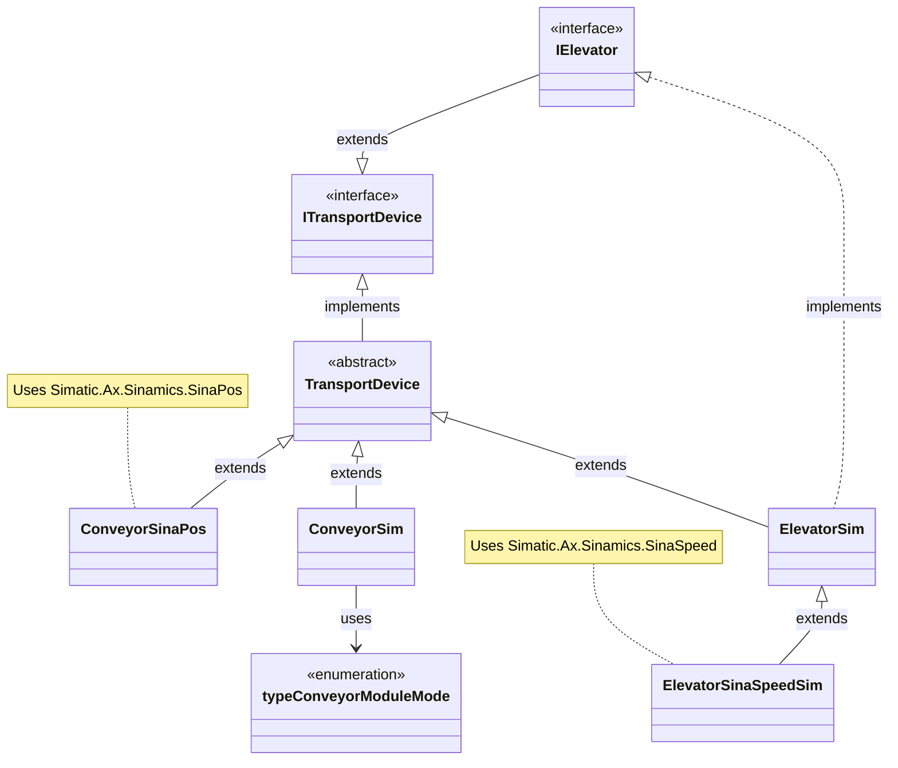

# Control Modules - UML Class Diagram

## Overview
This UML class diagram represents the control modules architecture for the sorting machine project, showing the inheritance hierarchy, interface implementations, and relationships between transport device classes. Here is was Simplified for the readability:



## Architecture Description

### **Interface Layer**

#### **`ITransportDevice`** (Base Interface)
The fundamental interface for all transport devices, defining:
- **Control Methods**: `Enable()`, `Disable()`, `Stop()`, `AckError()`
- **Status Methods**: `GetIsEnabled()`, `GetIsDone()`, `GetActualPosition()`, `GetStatus()`, `GetIsError()`
- **Movement Methods**: 
  - `PosAbsolute(targetPos)` - Move to absolute position
  - `PosRelative(posIncrement, velocity)` - Move by relative increment
  - `MoveVelocity(velocity)` - Continuous velocity-based movement
- **Execution**: `Execute()` - Cyclic call for device control logic

#### **`IElevator`** (Specialized Interface)
Extends `ITransportDevice` with elevator-specific operations:
- `MoveUp(velocity)` - Continuous upward movement until upper limit
- `MoveDown(velocity)` - Continuous downward movement until lower limit

### **Abstract Base Class**

#### **`TransportDevice`**
Abstract implementation providing common functionality:
- **Protected Variables**: `_enable`, `_done`, `_actualPos`, `_targetPos`, `_error`, `_ackError`, `_status`
- **Default Implementations**: Basic enable/disable, error handling, status reporting
- **Error Handling**: Returns `ERR_COMMAND_NOT_SUPPORTED` for unimplemented movement methods
- **Abstract Method**: `Execute()` must be implemented by derived classes

### **Conveyor Implementations**

#### **`ConveyorSinaPos`** (Hardware - Positioning)
Hardware implementation using Sinamics SinaPos drives for precise positioning:
- **Drive Control**: Integrates `SinaPos` function block from Simatic.Ax.Sinamics
- **Configuration**: `SetConfigSina()` for axis parameters, hardware IDs, and operating mode
- **Movement Modes**: 
  - Jog mode for continuous velocity control
  - Relative positioning with configurable velocity
  - Home position setting and axis referencing
- **Features**: Hardware-level position control, homing capability, precise positioning
- **Use Case**: Production conveyor requiring exact position control

#### **`ConveyorSim`** (Simulation - Full Featured)
Comprehensive simulation implementation for development and testing:
- **Simulation Logic**: Cycle-based increment movement with configurable step size
- **Operation Modes** (via `typeConveyorModuleMode` enum):
  - `IDLE` - No movement
  - `JOG` - Continuous velocity-based movement
  - `RELATIVE_POSITIONING` - Move by relative increment
  - `ABSOLUTE_POSITIONING` - Move to absolute target
  - `SET_HOME_POSITION` - Set current position as zero
- **Configuration**: `SetConfig(cycleIncrement)` for movement speed
- **Features**: 
  - Full position tracking and target reaching logic
  - Direction control (positive/negative movement)
  - Instant homing (always returns referenced)
  - Status reporting (idle, moving, positioning)
- **Use Case**: Development and testing without hardware dependency

### **Elevator Implementations**

#### **`ElevatorSim`** (Base Simulation)
Basic simulated elevator with configurable limits and cycle-based movement:
- **Limit Configuration**: `SetConfigLimits()` for cycle increment, upper/lower bounds
- **Movement Modes**:
  - Position-based movement with target validation
  - Continuous movement (up/down) until limits reached
- **Safety Features**: 
  - Target position validation against limits
  - Automatic stopping at limits
  - Direction determination based on target
- **Special Features**: `GetInvertedPosition()` for HMI display requirements
- **Use Case**: Simulated vertical transport for development

#### **`ElevatorSinaSpeedSim`** (Hardware-Integrated Simulation)
Simulation extending `ElevatorSim` with Sinamics SinaSpeed integration:
- **Drive Control**: Integrates `SinaSpeed` function block from Simatic.Ax.Sinamics
- **Configuration**: `SetConfigSina()` for SinaSpeed parameters, reference speed, hardware IDs
- **Enhanced Methods**:
  - Overrides `MoveUp()`/`MoveDown()` to use SinaSpeed velocity control
  - Adds `MoveVelocity()` for direct speed setpoint control
  - Includes limit checking before movement initiation
- **Diagnostics**: `GetDiagId()` for troubleshooting drive issues
- **Hybrid Approach**: Combines simulation logic with real drive communication
- **Use Case**: Testing with actual hardware or simulating SinaSpeed behavior

### **Key Design Patterns**

#### **Interface Segregation**
- `ITransportDevice` provides comprehensive transport operations (enable, movement, status)
- `IElevator` adds elevator-specific operations (`MoveUp`, `MoveDown`) without polluting the base interface
- Clean separation allows conveyor classes to use only `ITransportDevice`

#### **Template Method Pattern**
- `TransportDevice` provides common implementation with protected state variables
- Abstract `Execute()` method delegates hardware/simulation-specific logic to derived classes
- Default implementations for unsupported methods return errors gracefully

#### **Strategy Pattern**
- Different transport implementations (SinaPos, SinaSpeed, Simulated) can be used interchangeably
- Allows switching between hardware and simulation modes without changing station logic
- Polymorphic behavior through interface-based design

#### **State Machine Pattern**
- `ConveyorSim` uses `typeConveyorModuleMode` enum for operation states
- Clear state transitions: IDLE → JOG/POSITIONING → IDLE
- Prevents conflicting commands through state management

#### **Hardware Abstraction**
- Clean separation between hardware-specific implementations (`ConveyorSinaPos`, `ElevatorSinaSpeedSim`) and simulation
- Identical interfaces regardless of underlying implementation
- Enables development and testing without physical hardware

### **Key Features**

#### **Error Handling**
- All classes support error acknowledgment via `AckError()`
- Status word reporting with predefined error codes
- Protected error states prevent unsafe operations

#### **Movement Control**
- **Absolute Positioning**: Move to specific target position
- **Relative Positioning**: Move by increment from current position
- **Velocity Control**: Continuous movement at specified speed
- **Limit Protection**: Elevators enforce upper/lower bounds

#### **Simulation Capabilities**
- Cycle-based position increment simulation
- Configurable movement speeds via cycle increment
- Predictable behavior for testing and validation
- Status feedback matching hardware implementations

### **Usage Scenarios**

#### **Development Mode - Full Simulation**
```st
VAR
    conveyorControl : ConveyorSim;
    elevatorControl : ElevatorSim;
END_VAR

// Configuration
conveyorControl.SetConfig(cycleIncrement := INT#5);
elevatorControl.SetConfigLimits(
    cycleIncrement := INT#2,
    upperLimit := INT#100,
    lowerLimit := INT#0
);

// Usage
conveyorControl.Enable();
conveyorControl.PosAbsolute(targetPos := INT#500);
elevatorControl.MoveUp(velocity := INT#10);

// Cyclic execution
conveyorControl.Execute();
elevatorControl.Execute();
```

#### **Production Mode - Hardware Control**
```st
VAR
    conveyorControl : ConveyorSinaPos;
    elevatorControl : ElevatorSinaSpeedSim;
    sinaConfig : SinaPosConfiguration;
    speedConfig : SinaSpeedConfiguration;
END_VAR

// Configuration
conveyorControl.SetConfigSina(
    configSinaPos := sinaConfig,
    hwidSTW := UINT#256,
    hwidZSW := UINT#272,
    mode := SinaPosMode#RelativePositioning
);

elevatorControl.SetConfigSina(
    sinaSpeedConfig := speedConfig,
    sinaRefSpeed := REAL#1500.0,
    defaultVelocity := INT#50,
    hwidSTW := UINT#260,
    hwidZSW := UINT#276
);

// Usage - Same interface as simulation!
conveyorControl.Enable();
conveyorControl.PosRelative(posIncrement := INT#100, velocity := INT#50);
elevatorControl.MoveDown(velocity := INT#30);

// Cyclic execution
conveyorControl.Execute();
elevatorControl.Execute();
```

#### **Hybrid Testing - Mixed Mode**
```st
VAR
    conveyorControl : ConveyorSim;        // Simulated conveyor
    elevatorControl : ElevatorSinaSpeedSim;     // Real hardware elevator
END_VAR

// Test new elevator hardware while simulating conveyors
// Useful for staged hardware integration
```

#### **Polymorphic Station Control**
```st
VAR
    transportDevice : ITransportDevice;  // Can reference any implementation
    elevatorDevice : IElevator;          // Can reference any elevator
END_VAR

// Station classes work with interfaces, not concrete implementations
// Enables runtime flexibility and testing
```

### **Benefits of This Architecture**

1. **Hardware Independence**: Easy switching between simulation and hardware without code changes
2. **Testability**: Full functionality available without physical hardware through comprehensive simulation
3. **Maintainability**: Clear separation of concerns with consistent interfaces across implementations
4. **Extensibility**: New transport devices can be added by implementing `ITransportDevice` interface
5. **Polymorphism**: Station classes work with any `ITransportDevice` implementation via interface references
6. **Debugging**: Simulation classes provide predictable, cycle-based behavior for testing
7. **Gradual Integration**: Hybrid mode supports staged hardware commissioning
8. **Error Safety**: Consistent error handling and status reporting across all implementations
9. **Flexibility**: Multiple movement modes (absolute, relative, velocity) support diverse use cases
10. **Reusability**: Common base class reduces code duplication and ensures consistent behavior

### **Implementation Notes**

#### **Cyclic Execution Pattern**
All control modules must be called cyclically in the main program:
```st
PROGRAM Main
    // Call Execute() every cycle
    conveyorControl.Execute();
    elevatorControl.Execute();
END_PROGRAM
```

#### **Movement Command Pattern**
1. Enable the device: `device.Enable()`
2. Issue movement command: `device.PosAbsolute(target)`
3. Monitor completion: `IF device.GetIsDone() THEN ... END_IF`
4. Handle errors: `IF device.GetIsError() THEN device.AckError() END_IF`

#### **Simulation Increment Tuning**
For `ConveyorSim` and `ElevatorSim`:
- Larger `cycleIncrement` = faster movement
- Smaller `cycleIncrement` = smoother, more realistic movement
- Adjust based on PLC cycle time and application requirements

#### **Hardware Configuration**
For `ConveyorSinaPos` and `ElevatorSinaSpeedSim`:
- Ensure hardware IDs (`hwidSTW`, `hwidZSW`) match PLC configuration
- Configure drive parameters (reference speed, limits) according to hardware specifications
- Test with simulation first, then migrate to hardware implementation

This architecture enables flexible, maintainable, and testable control module implementations suitable for both development and production environments.