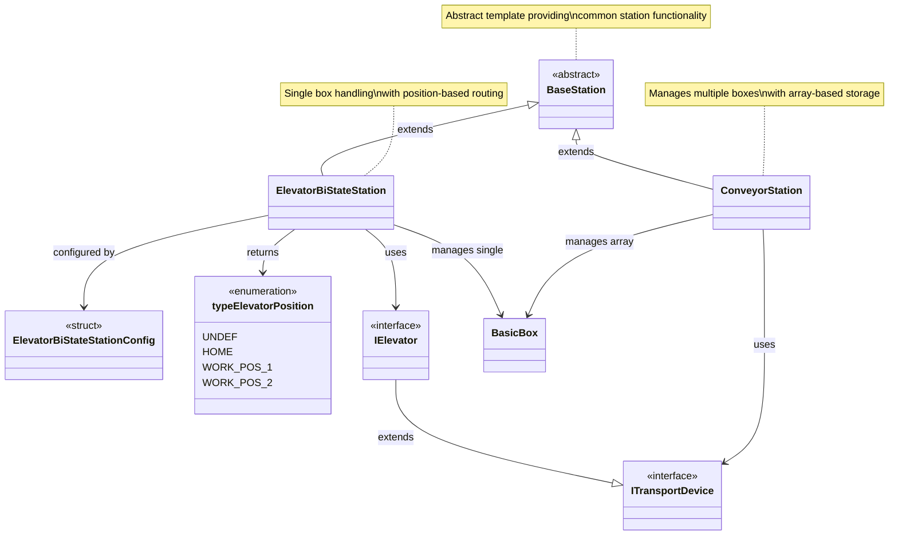
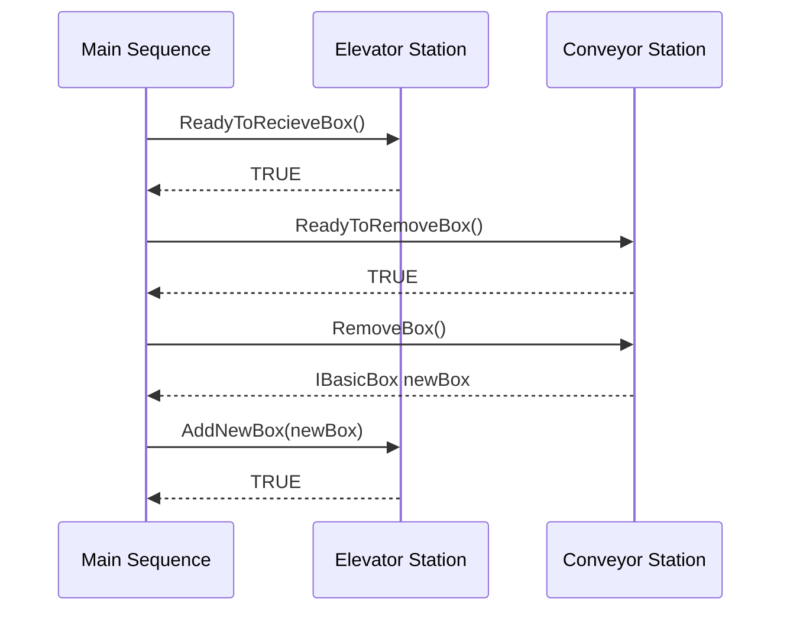
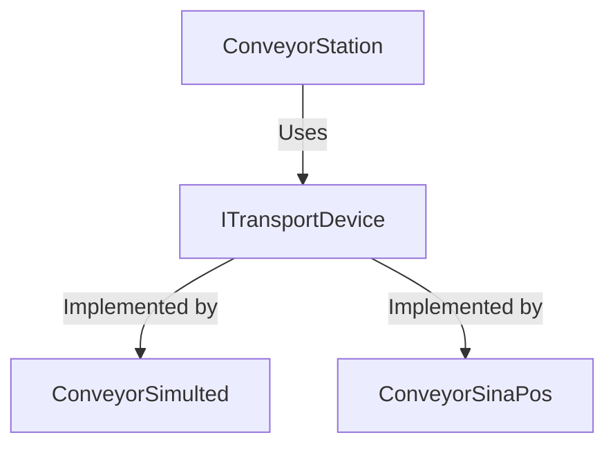

# Stations Architecture Documentation

## Overview
This document describes the station architecture for the sorting machine project, showing the inheritance hierarchy, relationships, and interactions between different station types. Stations are responsible for managing material handling operations and coordinate with control modules to execute physical movements.

## UML Class Diagram



## Architecture Description

### **Abstract Base Class: BaseStation**

The `BaseStation` class serves as the foundation for all station types, implementing the **Template Method Pattern** to provide consistent behavior across different station implementations.

#### **Core Responsibilities:**
1. **Lifecycle Management**: Enable/disable operations, reset functionality
2. **State Machine Foundation**: Common state handling (Idle, Error states)
3. **Error Management**: Error detection, acknowledgment, and recovery
4. **Status Reporting**: Standardized status and error code reporting
5. **Station Identification**: Unique ID and position tracking

#### **Protected Template Methods:**
- `handleReset()`: Common reset logic with derived class hooks
- `handleIdleState()`: Standard idle state processing
- `handleErrorState()`: Error state management
- `onReset()`: Abstract method for station-specific reset (must implement)
- `Execute()`: Abstract main cycle method (must implement)

### **Station Implementations**

#### **1. ConveyorStation**
**Purpose**: Manages horizontal box transport along conveyor belts with multiple box capacity.

**Key Features:**
- **Multi-Box Management**: Array-based storage for up to 7 boxes (configurable)
- **Incremental Movement**: Step-by-step box advancement with collision detection
- **Box Lifecycle**: Add, move, and remove operations with state tracking
- **Position Tracking**: Maintains individual box positions during movement
- **Hardware Abstraction**: Uses `ITransportDevice` interface for control

**State Machine:**
- **State 0 (IDLE)**: Ready for operations, handles box addition and removal
- **State 1 (MOVING)**: Active movement, position updates, collision prevention
- **State 99 (ERROR)**: Error condition, awaiting acknowledgment

**Box Flow Operations:**
1. `AddNewBox()` - Accepts new box at input position
2. `MoveIncrement()` - Triggers one-step movement
3. `ReadyToRemoveBox()` - Indicates box at output position
4. `RemoveBox()` - Removes box from output position

**Hardware Integration:**
- Configurable `ITransportDevice` (ConveyorSimulated, ConveyorSinaPos)
- Position-based movement with encoder feedback
- Collision detection during movement

#### **2. ElevatorBiStateStation**
**Purpose**: Vertical transport with intelligent routing based on box properties.

**Key Features:**
- **Single Box Operation**: Manages one box at a time
- **Bi-State Logic**: Routes boxes to upper/lower positions based on properties
- **Position Management**: Tracks HOME, WORK_POS_1, WORK_POS_2 positions
- **Property-Based Routing**: Uses box color to determine destination
- **Precision Positioning**: Configurable precision offset for position tolerance

**State Machine:**
- **State 0 (IDLE)**: Waiting at home position for box input
- **State 1 (MOVING)**: Moving to target position based on box properties
- **State 2 (WAIT_REMOVE_BOX)**: At target, ready for box removal
- **State 3 (RETURN_HOME)**: Returning to home position after box removal
- **State 99 (ERROR)**: Error condition, awaiting acknowledgment

**Routing Logic:**
```
Box Color = ConditionUp → Move to PositionUpLimit (WORK_POS_2)
Box Color = ConditionDown → Move to PositionDownLimit (WORK_POS_1)
No Box → Return to PositionHome (HOME)
```

**Hardware Integration:**
- Configurable `IElevator` interface (ElevatorSim, ElevatorSinaSpeed)
- Limit switches and position feedback
- Safety interlocks and overload detection


### **Station Communication Pattern**

Stations communicate through standardized box transfer protocols:

<!-- Example sequence diagram for box exchange between Conveyor and Elevator station -->



### **Box Transfer Protocol**

#### **Sender Station:**
1. Box reaches output position
2. Set `_readyToRemoveBox = TRUE`
3. Wait for external `RemoveBox()` call
4. Return `IBasicBox` interface
5. Mark box for clearing (`_pendingBoxClear = TRUE`)

#### **Receiver Station:**
1. Check `ReadyToReciveBox()` (returns TRUE if capacity available)
2. Call `AddNewBox(newBox: IBasicBox)` 
3. Receive BOOL result (TRUE = accepted, FALSE = rejected)
4. Box data copied internally to receiver's storage

### **State Management Philosophy**

All stations follow consistent state management principles:

#### **Idle State:**
- Station ready and enabled
- No active operations
- Accepts new commands
- Monitors for box presence/readiness

#### **Processing State:**
- Active operation in progress
- Station marked as busy
- Movement/positioning occurring
- Collision/safety monitoring active

#### **Error State:**
- Fault condition detected
- All operations halted
- Ready flag cleared
- Requires acknowledgment to clear

#### **Reset Behavior:**
- Clears all internal state
- Resets box data
- Returns to idle state
- Calls derived class `onReset()` for specific cleanup

### **Configuration and Initialization**

#### **ConveyorStation Configuration:**
```st
ConveyorStation.CONSTRUCTOR(
    stationID := 1,
    stationPosLeft := 0,
    moveIncrement := 128,              // Box width for positioning
    conveyorControl := myConveyor,     // ITransportDevice implementation
    boxInputIndex := 6                 // Last array position
);
```

#### **ElevatorBiStateStation Configuration:**
```st
VAR
    elevatorConfig : ElevatorBiStateStationConfig;
END_VAR

elevatorConfig.ConditionUp := COLOR_CODE_YELLOW;
elevatorConfig.ConditionDown := COLOR_CODE_GREEN;
elevatorConfig.PositionUpLimit := 100;
elevatorConfig.PositionDownLimit := 0;
elevatorConfig.PositionHome := 0;
elevatorConfig.PrecisionOffset := 1;

Elevator.CONSTRUCTOR(
    stationID := 2,
    stationPosLeft := 256,
    elevatorControl := myElevator,     // IElevator implementation
    stationConfig := elevatorConfig
);
```

### **Error Handling Strategy**

#### **Error Detection:**
- Position limit violations
- Collision detection during movement
- Box capacity exceeded
- Hardware faults from control modules
- Configuration errors

#### **Error Reporting:**
- Station-specific error codes (0x8000 range)
- `GetError()` returns BOOL flag
- `GetStatus()` returns WORD error code
- `GetErrorAndStatus()` returns combined structure

#### **Error Recovery:**
1. `AcknowledgeError()` - Clears error flag
2. `Reset()` - Full station reset
3. Derived classes implement `clearError()` for specific cleanup
4. Control modules automatically acknowledged during station reset

### **Integration with Control Modules**

Stations use control module interfaces for hardware abstraction:




This abstraction enables:
- **Development Mode**: Use simulated control modules
- **Production Mode**: Use hardware control modules
- **Testing**: Mix simulated and real hardware
- **Hardware Independence**: Station logic unchanged when switching implementations

### **Design Patterns Used**

#### **1. Template Method Pattern**
- `BaseStation` provides algorithm skeleton
- Derived classes implement specific steps
- Common behavior in base class, variations in derived classes

#### **2. Strategy Pattern**
- Control modules are interchangeable strategies
- Stations work with interfaces, not concrete implementations
- Runtime flexibility to switch hardware/simulation

#### **3. State Pattern**
- Explicit state machine implementation
- State-specific behavior encapsulated
- Clear state transitions

#### **4. Factory Pattern** (Implicit)
- Constructors set up complete station configurations
- Dependency injection for control modules
- Configuration structs for complex setups

### **Best Practices and Guidelines**

#### **When Creating New Station Types:**
1. Extend `BaseStation` abstract class
2. Implement required abstract methods (`Execute()`, `onReset()`)
3. Call base class template methods (`handleReset()`, `handleIdleState()`, `handleErrorState()`)
4. Use protected methods for internal operations
5. Define station-specific error codes in 0x8000+ range
6. Document state machine states and transitions

#### **Station Communication:**
1. Always check `ReadyToReciveBox()` before `AddNewBox()`
2. Check `ReadyToRemoveBox()` before `RemoveBox()`
3. Handle FALSE returns (box rejected)
4. Clear pending boxes in idle state
5. Use `IBasicBox` interface for box transfers

#### **Error Handling:**
1. Use `setError(errorCode)` for error conditions
2. Implement station-specific `clearError()` if needed
3. Always acknowledge control module errors
4. Provide meaningful error codes
5. Document error conditions and recovery procedures

### **System Integration Example**

Complete sorting system with three conveyor stations and one elevator:

```st
// Input Conveyor → Elevator → Output Conveyors (Upper/Lower)

ConveyorStation1.Execute();  // Input conveyor
Elevator.Execute();           // Elevator sorting
ConveyorStation2.Execute();  // Upper output
ConveyorStation3.Execute();  // Lower output

// Box transfer coordination
IF ConveyorStation1.ReadyToRemoveBox() AND Elevator.ReadyToReciveBox() THEN
    Elevator.AddNewBox(ConveyorStation1.RemoveBox());
END_IF;

IF Elevator.ReadyToRemoveBox() THEN
    CASE Elevator.GetElevatorPositionEnum() OF
        typeElevatorPosition#WORK_POS_2:
            IF ConveyorStation2.ReadyToReciveBox() THEN
                ConveyorStation2.AddNewBox(Elevator.RemoveBox());
            END_IF;
        typeElevatorPosition#WORK_POS_1:
            IF ConveyorStation3.ReadyToReciveBox() THEN
                ConveyorStation3.AddNewBox(Elevator.RemoveBox());
            END_IF;
    END_CASE;
END_IF;
```

This architecture provides a robust, maintainable, and extensible framework for material handling stations in industrial automation systems.