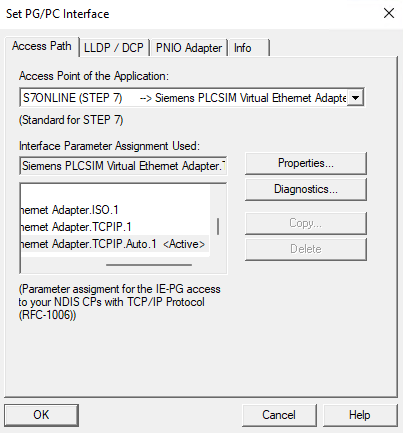
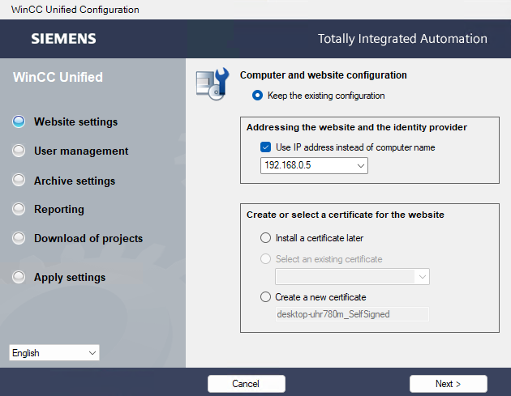
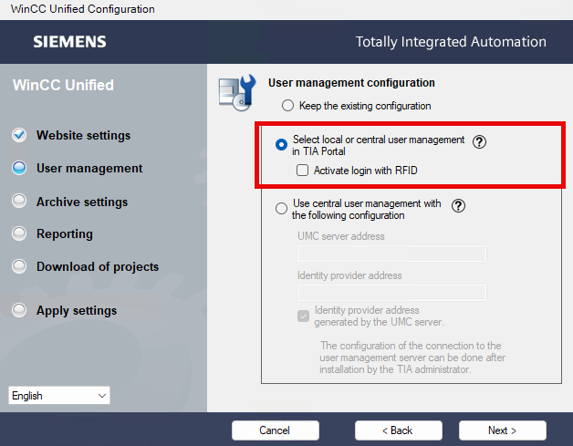
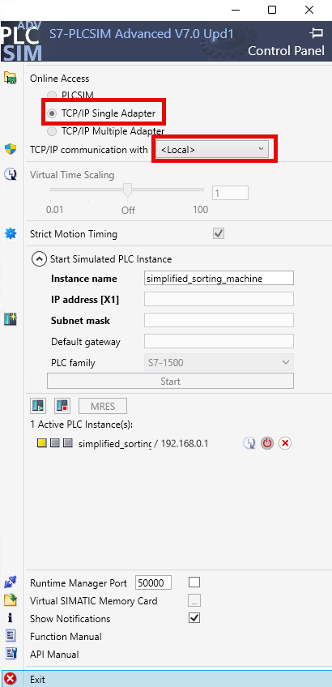

# Sorting Machine Project

## Project Overview

This project serves as a simple application example, providing a demo case for exploring the interaction between Control Logic Engineering and Unified Elements. It also covers the installation of GSD files and demonstrates hardware integration. Feel free to adapt and extend this project to implement additional functionalities according to your needs.


## Table of Contents
*   [Project Overview](#project-overview)
*   [Key Features](#key-features)
*   [System Requirements](#system-requirements)
    *   [Required Hardware](#required-hardware)
    *   [Required Software](#required-software)
*   [Usage Instructions](#usage-instructions)
*   [General Prerequisites](#general-prerequisites)
*   [Local Simulation Setup](#local-simulation-setup)
    *   [Hardware & Network Configuration for local Simulation](#hardware--network-configuration-for-local-simulation)
        *   [PG/PC Interface Setup for local Simulation)](#1-pgpc-interface-setup)
        *   [IP Address Settings for local Simulation](#2-ip-address-settings-for-local-simulation)
    *   [SIMATIC AX Logic Control Engineering Steps](#simatic-ax-logic-control-engineering-steps)
    *   [SIMATIC AX WinCC Unified Elements Steps](#simatic-ax-wincc-unified-elements-steps)
*   [Physical Hardware Deployment](#physical-hardware-deployment)
    *   [Hardware & Network Configuration for physical Devices](#hardware--network-configuration-for-physical-devices)
        *   [PG/PC Interface Setup physical Devices)](#1-pgpc-interface-setup-1)
        *   [IP Address Settings for physical Devices](#2-ip-address-settings-for-physical-devices)
    *   [SIMATIC AX Logic Control Engineering Steps for Hardware](#simatic-ax-logic-control-engineering-steps-for-hardware)
    *   [SIMATIC AX WinCC Unified Elements Steps for Hardware](#simatic-ax-wincc-unified-elements-steps-for-hardware)
*   [Useful Links](#useful-links)
*   [License](#license)

## Key Features

1.  Hardware configuration with support packages
2.  Hardware configuration with GSD files
3.  Software programming with preprocessor directives
4.  OPC UA exposed variables for visualization
5.  Advanced operational Visualization
6.  Commissioning capabilities (including scripts)
7.  Diagnostics capabilities (including scripts)

## System Requirements


### Required Hardware

-   IPC: SIMATIC IPC PX-39A   : 6AV7242-7AJ20-2AB0
-   PLC: S71516 PN/DP         : 6ES7 516-3AP03-0AB0
-   SINAMICS G220             : 6SL4112-0CA05-0AF0

### Required Software

The PLC program in this project was exclusively created using SIMATIC AX Logic Control Engineering. The visualization was exclusively developed in SIMATIC AX WinCC Unified Elements. Furthermore, the configuration of the SINAMICS G220 was not performed with SINAMICS Startdrive, but through its web configuration interface.

-   SIMATIC AX Logic Control Engineering - [Download](https://console.simatic-ax.siemens.io/downloads)
-   SIMATIC AX WinCC Unified Elements - [Download](https://docu.simatic-ue.siemens.io/download_ue/)
-   SIMATIC S7-PLCSIM Advanced - [Download](https://support.industry.siemens.com/cs/ww/en/view/109963863)

## Usage Instructions

This application example repository can be cloned using Git. Additionally, a project template package is available for rapid AX project creation utilizing `apax`.

> To use this application example, you need to log in to the GitHub registry https://npm.pkg.github.com/. You'll find more information [here](https://github.com/simatic-ax/.github/blob/main/docs/personalaccesstoken.md).

## General Prerequisites

-   GitHub account and access token
-   Installed SIMATIC AX Logic Control Engineering and SIMATIC AX WinCC Unified Elements environments
-   Network configuration for PLC simulation or hardware

## Local Simulation Setup

### Hardware & Network Configuration for local Simulation

To ensure your local simulation runs smoothly, here's how to configure your hardware settings:

#### 1. PG/PC Interface Setup

To correctly set up the PG/PC interface for local simulation, please follow these steps:

1.  Open "Set PG/PC Interface (32-bit)" in the Control Panel.
2.  Select "Siemens PLCSIM Virtual Ethernet Adapter.TCPIP.Auto.1" from the list.
3.  Confirm any warning messages with "Ok" and then close the window.



#### 2. IP Address Settings for local Simulation

For this local simulation example, the following IP addresses were used:

*   **SIMATIC PLCSIM Advanced Instance:** `192.168.0.1`
*   **Siemens PLCSIM Virtual Ethernet Adapter:** `192.168.0.5`

**Important!** If the IP address of the Siemens PLCSIM Virtual Ethernet Adapter is changed, it is crucial that the WinCC Unified Configuration is run again to apply the changes correctly.




Please note: These settings are provided as an example and can be adjusted to fit your specific setup. The critical aspects are ensuring the correct PG/PC interface is selected, that both the SIMATIC PLCSIM Advanced instance and the Siemens PLCSIM Virtual Ethernet Adapter reside within the same IP address range, and that the Unified Configuration has been executed at least once with active user management enabled.

#### 3. S7-PLCSIM Advanced settings

The following shows an example configuration of PLCSIM Advanced.



### SIMATIC AX Logic Control Engineering Steps

1.  Log in to SIMATIC AX:
    ```sh
    apax login
    ```
2.  Navigate to the desired folder.
3.  Load the application example:
    ```sh
    apax create @simatic-ax/simplified-sorting-machine --registry https://npm.pkg.github.com simplified-sorting-machine
    ```
    (Optional) Open in AX Code:
    ```sh
    axcode .
    ```
4.  Log in into the GitHub registry https://npm.pkg.github.com/ if not already done.
5.  Install dependencies:
    ```sh
    apax install
    ```
6.  Install certificates:
    ```sh
    apax setup_hw_certificates_and_user
    ```
7.  Compile and load S7-PLCSIM Advanced:
    ```sh
    apax compile_and_load_all
    ```
    When using S7-PLCSIM Advanced, a PLC instance needs to be started using *TCP/IP Single Adapter* or *TCP/IP Multiple Adapter*

### SIMATIC AX WinCC Unified Elements Steps

1.  Ensure SIMATIC AX Logic Control Engineering steps 1–3 are completed.
2.  Navigate to your project folder.
3.  Open SIMATIC AX WinCC Unified Elements.
4.  Install dependencies:
    ```sh
    apax install
    ```
5.  Change IP locally:
    ```sh
    apax changeip_local
    ```
6.  Download the project:
    ```sh
    apax fulldownload
    ```

## Physical Hardware Deployment

### Hardware & Network Configuration for physical Devices

To ensure your physical devices are runing smoothly, here's how to configure your hardware settings:

#### 1. PG/PC Interface Setup

To correctly set up the PG/PC interface for physical Devices, please follow these steps:

1.  Open "Set PG/PC Interface (32-bit)" in the Control Panel.
2.  Select the network adapter connected to the physical hardware.
3.  Confirm any warning messages with "Ok" and then close the window.

#### 2. IP Address Settings for physical Devices

*   **SIMATIC S7-1500 PLC:** `192.168.0.1`
*   **SINAMICS G220:** `192.168.0.2`
*   **SIMATIC IPC:** `192.168.0.3`
*   **Network Adapter:** `192.168.0.10`

Please note: These settings are provided as an example and can be adjusted to fit your specific setup. The critical aspects are ensuring the correct PG/PC interface is selected, that all Devices are within the same IP address range, and that the Unified Configuration has been executed at least once with active user management enabled.


### SIMATIC AX Logic Control Engineering Steps for Hardware

1.  Log in to SIMATIC AX:
    ```sh
    apax login
    ```
2.  Navigate to the desired folder.
3.  Clone the repository:
    ```sh
    git clone <repository-link>
    ```
    (Optional) Open in AX Code:
    ```sh
    axcode .
    ```
4.  Log in into the GitHub registry https://npm.pkg.github.com/ if not already done.
5.  Install dependencies:
    ```sh
    apax install
    ```
6.  Install certificates:
    ```sh
    apax setup_hw_certificates_and_user
    ```
7.  Compile and load S7-1500 PLC:
    ```sh
    apax compile_and_load_all
    ```

### SIMATIC AX WinCC Unified Elements Steps for Hardware

1.  Ensure SIMATIC AX Logic Control Engineering steps 1–3 are completed.
2.  Navigate to your project folder.
3.  Open SIMATIC AX WinCC Unified Elements.
4.  Install dependencies:
    ```sh
    apax install
    ```
5.  Change IP locally:
    ```sh
    apax changeip_remote
    ```
6.  Download the project:
    ```sh
    apax fulldownload
    ```
## Internal Readmes
- [SIMATIC AX Readme](AX/README.md)
- [SIMATIC UE Readme](UE/README.md)

## Useful Links

-   [SIMATIC AX WinCC Unified Elements Documentation](https://docu.simatic-ue.siemens.io/learn/documentation/document-based-engineering/)
-   [SIMATIC AX Logic Control Engineering Documentation](https://docs.industrial-operations-x.siemens.cloud/p/simatic-ax)

## License

[LICENSE.md](LICENSE.md)
