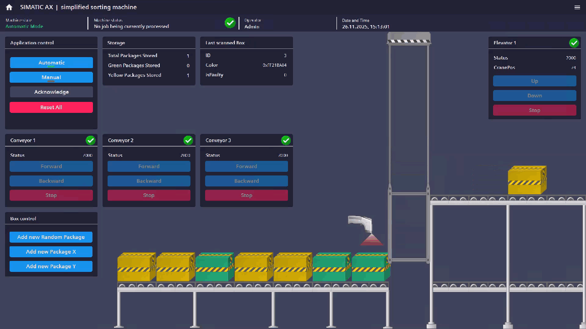
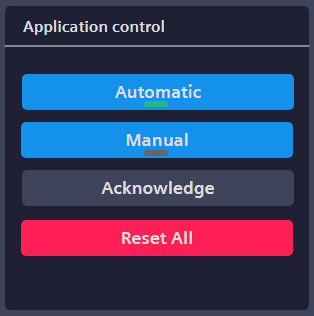
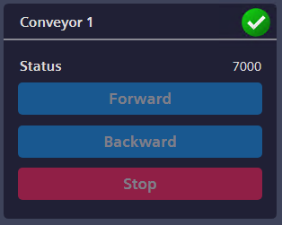
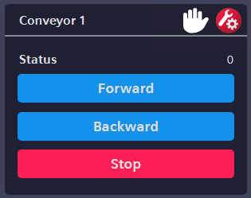
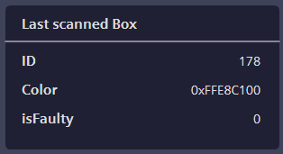
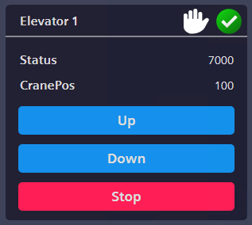
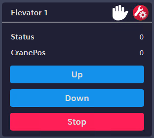

# Simplified Sorting Machine

## Project Description
This project illustrates the interaction between SIMATIC AX WinCC Unified Elements and SIMATIC AX Logic Control Engineering through a small package sorting machine.

Packages arrive on the left conveyor belt, are scanned by a handheld scanner, and sorted based on color: either to the upper conveyor via the elevator or to the lower conveyor. When packages reach the end of the right screen, they are stored. The system tracks the count of each color.

Modes available:
- **Automatic Mode**: Fully autonomous operation.
- **Manual Mode**: Manual control of conveyors, elevator, and box creation.

## Features

### Application Control

The Application Control enables switching between Manual and Automatic modes. The currently active mode is indicated by a small gray/green rectangle.

- **Acknowledge Button**: Clears pending notifications.
- **Reset All Button**: Removes all boxes and resets storage values.

### Conveyor Control

The Conveyor Faceplate displays the current modes (Manual/Automatic). In Manual Mode, a small hand icon is shown at the top. Additionally, an error is displayed next to it in case of a fault. The status is located above the buttons. The buttons are only operable in Manual Mode.

### Box Control
- Determines next box color (X = Green, Y = Yellow).
- Available in both modes.

### Storage Status
- Displays stored packages and quantity per color.

### Last Scanned Box
- Shows ID, color code, and defect status of the current box.

### Elevator Control
The Elevator Faceplate displays the elevator's current status, its position, and any active errors. The position is shown on a scale where 100 indicates the 'down' position and 0 the 'up' position. Manual operation of the elevator is only possible when the faceplate is in Manual Mode. The automatic positioning of the elevator is handled by the PLC

For detailed instructions on modifying SIMATIC AX WinCC Unified Elements, please refer to the documentation [SIMATIC AX WinCC UnifiedElements Documentation](https://docu.simatic-ue.siemens.io/learn/documentation/document-based-engineering/).

## Application Login
For the intent of this application example, here ais the configured login:
* User: Admin
* Password: Simatic123!

The username and passwrod should not be stored in plain text visible for everyone. Here it is shown only for the application example and should be changed if used for production.
